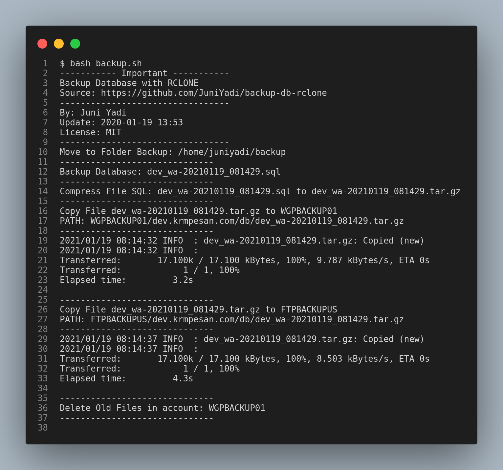

- [Backup Database with rclone](#backup-database-with-rclone)
  - [Feature](#feature)
  - [Tested](#tested)
  - [Install MySQL Client](#install-mysql-client)
  - [Install RClone](#install-rclone)
    - [Create RClone Config](#create-rclone-config)
  - [Install Instruction](#install-instruction)
  - [Command Install](#command-install)
  - [How to Use](#how-to-use)
    - [Default Config](#default-config)
    - [Custom Config Path](#custom-config-path)
  - [Crontab](#crontab)

# Backup Database with rclone



## Feature
- Rclone as Remote Storage
- Multiple Rclone Account Upload
- Auto Delete Files XX Days
- Auto Compress File SQL
- Auto Delete Local Files or Not
- Dynamic Config
- Support Multiple Config

## Tested
| Name   | Version      |
|--------|--------------|
| OS     | Ubuntu 20.04 |
| MySQL  | 8.0          |
| rclone | 1.53.3       |

## Install MySQL Client

```
sudo apt install mysql-client
```

## Install RClone

```
curl https://rclone.org/install.sh | sudo bash
```

### Create RClone Config

```
rclone config
```

Ref: https://rclone.org/commands/rclone_config/

## Install Instruction

- Copy file **backup.sh** to user folder
- Copy file **.backup-rclone.example** to user folder
- Rename **.backup-rclone.example** to **.backup-rclone**
- Edit **.backup-rclone**

## Command Install

```
wget -O backup.sh https://raw.githubusercontent.com/JuniYadi/backup-db-rclone/main/backup.sh
wget -O .backup-rclone https://raw.githubusercontent.com/JuniYadi/backup-db-rclone/main/.backup-rclone.example
```

**For Update Script, Just Download `backup.sh` files only**

## How to Use

### Default Config

```
bash backup.sh
```

### Custom Config Path

**If you want use custom config file, you can reference config in command, example:**

```
bash backup.sh /path/file/backup-rclone
```

## Crontab

```
0 0 * * * bash /path/file/backup.sh
```